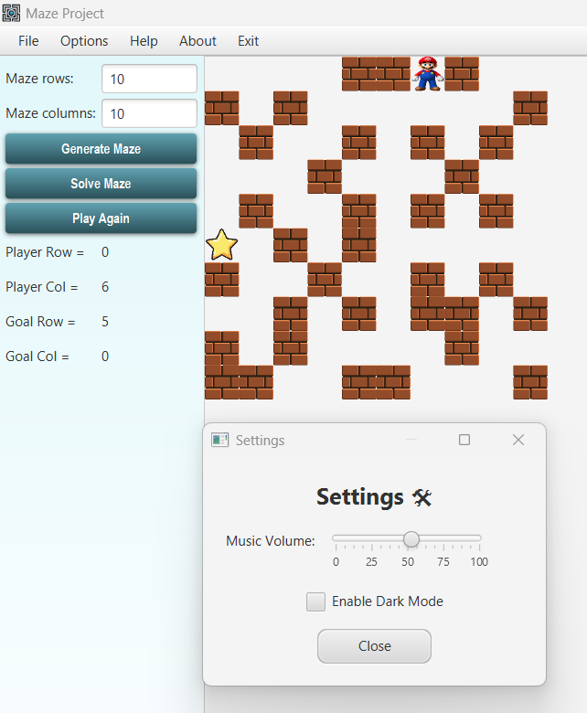
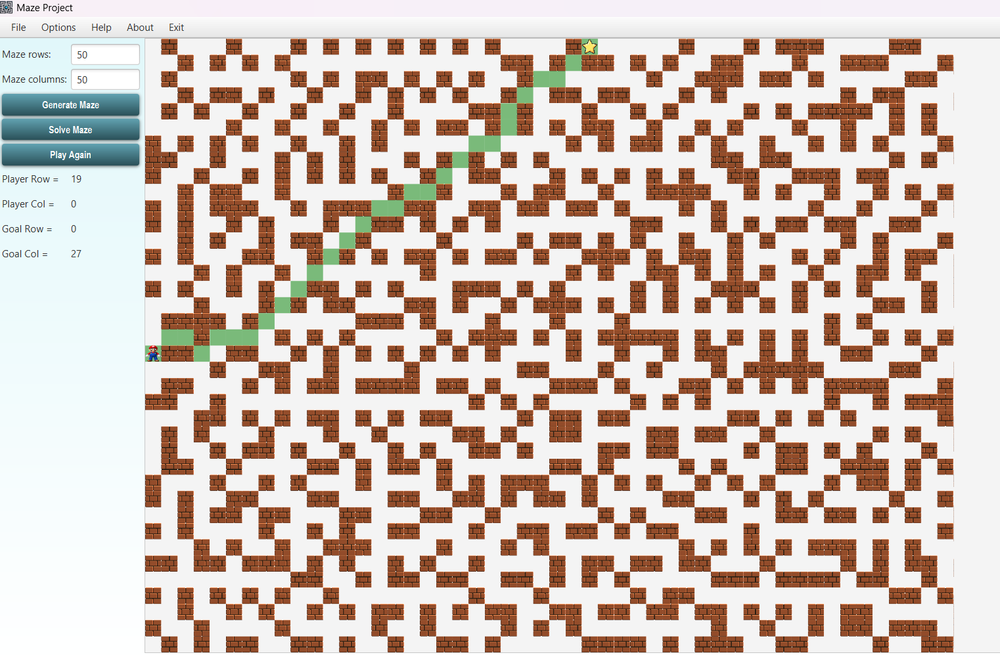

# 🎮 Maze Project – JavaFX Maze Solver

An educational and interactive maze-solving project built in Java using object-oriented programming, client-server architecture, and a JavaFX GUI (MVVM). Designed as part of an academic programming course, this project demonstrates advanced programming concepts in a modular and layered manner.

---

## 📦 Technologies Used

- **Java 15+**
- **JavaFX** (GUI)
- **MVVM** Architecture
- **Multithreading** (Java Threads)
- **Client-Server Communication** (Sockets, Object Streams)
- **Custom Compression** (via Output/Input Streams)
- **JUnit 5** for Unit Testing
- **Maven** for Build Management

---

## 🧠 Architecture Overview

### 🧩 Part A – Core Logic and Algorithms
- Maze generation: `EmptyMazeGenerator`, `SimpleMazeGenerator`, `MyMazeGenerator`
- Search algorithms: `BreadthFirstSearch`, `DepthFirstSearch`, `BestFirstSearch`
- Abstractions: `IMazeGenerator`, `ISearchingAlgorithm`, `ISearchable`

### 🔗 Part B – Compression and Server-Client Communication
- Servers: Generate or solve mazes via sockets
- Compress/Decompress mazes to reduce file size (e.g. RLE logic)
- Save/load mazes and solutions
- Multithreaded server using Java `ExecutorService`
- Custom streams: `MyCompressorOutputStream`, `MyDecompressorInputStream`

### 🖼️ Part C – JavaFX GUI (MVVM)
- Fully functional desktop app with a user-friendly interface
- MVVM separation (Model, ViewModel, View)
- Maze display, navigation, and animation
- Live player and goal position updates
- Menu system and interactive settings

---

## ✅ GUI Features Overview

---

## 🖼️ Screenshots

### Main Game UI



*Solve, play, and regenerate maze puzzles easily.*

---
### 💡 Main Features
- JavaFX graphical interface
- MVVM (Model-View-ViewModel) architecture
- Maze display as a grid with graphical components
- Interactive player (character) that can move within the maze
- Goal (⭐) and walls (🧱) are visually rendered
- Animated transitions (optional)

### 🕹️ Controls
- `Generate Maze` – creates a new random maze
- `Solve Maze` – triggers automatic solving using a search algorithm
- `Play Again` – resets the player's position to the start

---

## 📍 Display Information
- Current Player Position (row, col)
- Goal Position (row, col)

---

## ⚙️ Settings Window
- 🎵 **Music volume control** – adjustable via slider
- 🌙 **Dark Mode toggle** – checkbox to enable/disable dark mode
- ❌ `Close` button – closes the settings popup

---

## 🗂️ Menu Bar Features

### 📁 File Menu
- `New Game` – start a new game with a freshly generated maze
- `Save Game` – saves the current game state to file
- `Load Game` – loads a previously saved maze and player state
- `Exit` – closes the application safely

### 🛠️ Options Menu
- `Settings` – open settings popup for volume and theme
- `Mute` – quickly disable sound
- `Change Theme` – toggle between Light/Dark modes (if implemented)

---

These features collectively demonstrate:
- GUI event handling
- UI state binding
- File I/O operations for serialization
- Smooth JavaFX integration using the MVVM pattern


---

## 📁 Folder Structure (Simplified)

```
src/
│
├── algorithms/
│   ├── mazeGenerators/
│   └── search/
├── IO/
├── Server/
├── Client/
├── GUI/
│   ├── View/
│   ├── ViewModel/
│   └── Model/
├── test/
```

---
